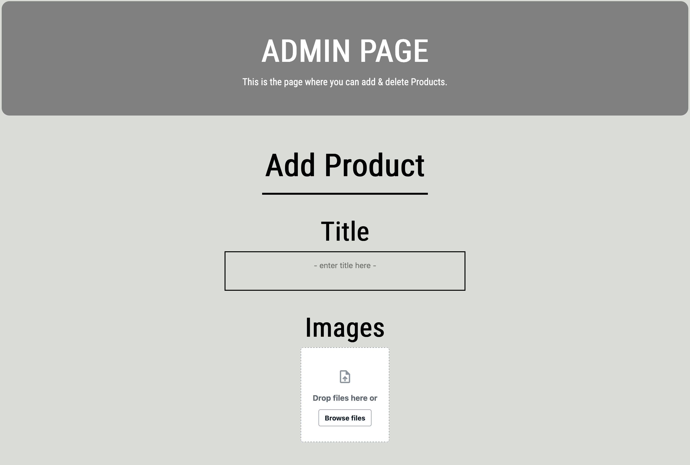
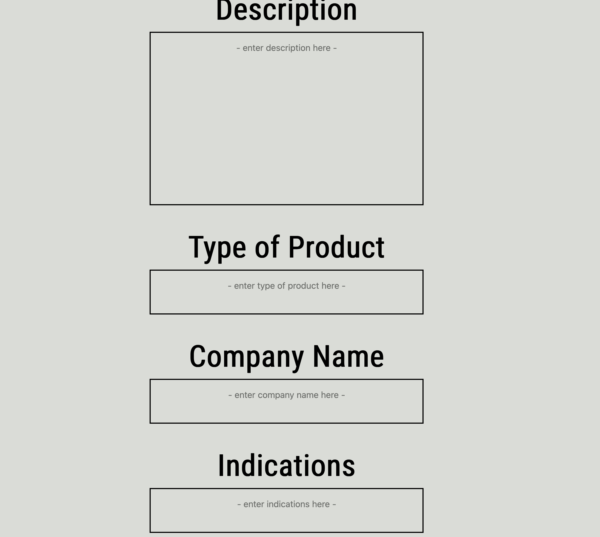
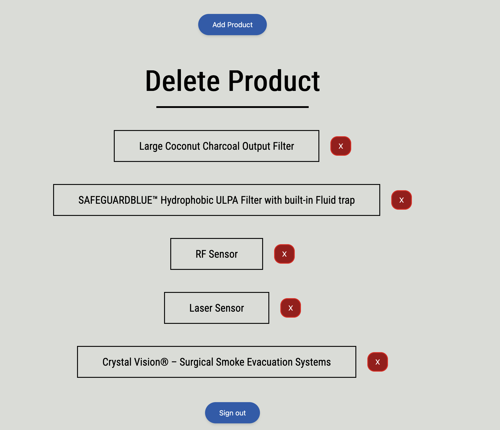

# GMA Medical Website  

This project was developed during my internship at **GMA Medical**. The goal was to design and build a modern, responsive website to showcase GMA Medical’s products, provide search and browsing capabilities for customers, and give administrators the ability to manage catalog content.  

---

## 🚀 Project Overview  

- **Purpose**:  
  Create a scalable product catalog platform for GMA Medical with secure authentication, intuitive search, and a clean UI for both customers and admins.  

- **Key Features**:  
  - Responsive design for desktop and mobile  
  - Product catalog with search and filtering  
  - Admin dashboard for managing products  
  - Secure authentication and authorization  
  - Hosted with reliable CI/CD pipelines  

---

## 🛠️ Tech Stack  

- **Frontend**:  
  - [Next.js](https://nextjs.org/) (React + TypeScript)  
  - [Tailwind CSS](https://tailwindcss.com/) for styling  

- **Backend & Cloud Services**:  
  - [AWS Amplify](https://aws.amazon.com/amplify/) for hosting & CI/CD  
  - [AWS Cognito](https://aws.amazon.com/cognito/) for authentication  
  - [AWS DynamoDB](https://aws.amazon.com/dynamodb/) for database storage  
  - [Amazon S3](https://aws.amazon.com/s3/) for storing product images

- **Other Tools**:  
  - Git & GitHub for version control  
  - [Figma](https://www.figma.com/design/RFZZEurapkFB1Auxnz5dgI/GMA-Medical-High-Fidelity-Wireframe?node-id=0-1&t=bVhGmZl2JcJot2lj-1) (for UI/UX design prototypes)  

---

## 🖥️ Admin Dashboard Features  

The Admin Dashboard is the control center for product management. It provides secure access to authorized users, allowing them to **add and delete products** from the GMA Medical catalog.  

---

### ➕ Adding a Product  

Admins can add new products to the catalog by following these steps:  

1. **Navigate to the Admin Dashboard**  
   After logging in, admins land on the dashboard where all the features are listed.   

2. **Fill out the product details**:  
   - **Title** – Enter the product’s name.  
   - **Images** – Upload one or more images of the product.  
   - **Description** – Provide a detailed description.  
   - **Type** – Enter the category/type of product.  
   - **Company Name** – Input the manufacturer or brand.  
   - **Indications** – Add the intended medical uses or indications.  

3. **Add the Product**  
   Clicking add will add the new product to the catalog, where it becomes visible to customers.  

---

### 🗑️ Deleting a Product  

Admins can remove products from the catalog when they are outdated or no longer available.  

1. **Locate the Product**  
   In the Admin Dashboard product list, find the product you want to delete.  

2. **Click the Red “Delete” Button**  
   Each product row includes a delete button for quick removal.   

3. **Product Removed**  
  The product is permanently deleted from the catalog and will no longer be visible to customers.   

   📸 **Example**:  


 

## ⚙️ Development  

1. **Clone the repository**  
   ```bash
   git clone https://github.com/<your-username>/gma-medical.git
   cd gma-medical
